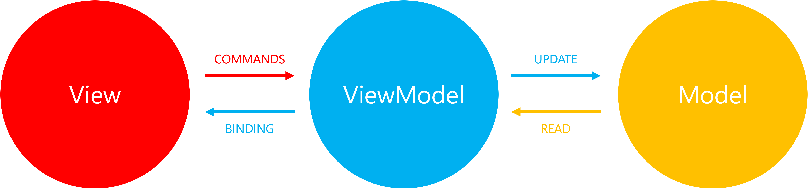
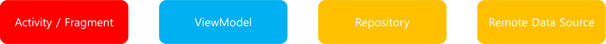

# OwnLab-SAClient

## Overview

## 🛠 Teck Stacks

## Front-end

## Back-end

## DevOps

## Architectures

We basically applied the MVVM design pattern to this project.

> It was proposed by John Gossman as an alternative to MVC and MVP design patterns when using data binding technology.

    

    Figure 1. MVVM Architectural Pattern

    

    Figure 2. Another representation of the pattern

